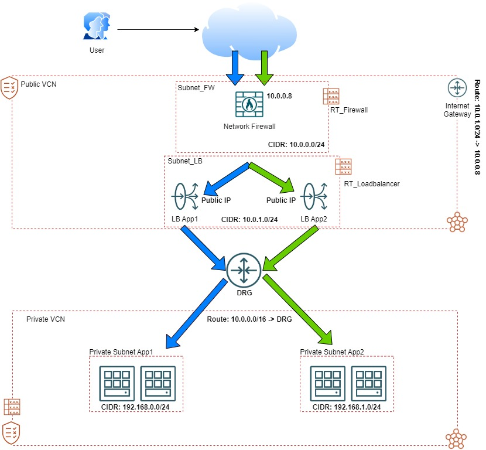

# OCI Network Firewall - Reference Architecture

We are using combined architecture where we are using dynamic routing gateway with OCI Network Firewall running in Firewall VCN (Hub VCN) and a pair of OCI Load Balancers to provide access to our backend servers containing simple web pages. 

This architecture uses the DRG technology that's connected to Public and Private networks around it. And, to inspect and protect all connections, we're using OCI Network Firewall in a intra-vcn routing architecture inside the Public VCN.

**Note**: You can deploy OCI Network Firewall in Distributed and/or Transit Architecture. To learn more about architecture check the official Reference Architecture docs [here](https://docs.oracle.com/en/solutions/oci-network-firewall). Deployment of **OCI Network Firewall** takes some time so consider that.

## Acknowledgements
**Important**: This lab (and this documentation) is based on the OCI Network Firewall - Reference Architecture available [here](https://github.com/oracle-quickstart/oci-network-firewall/tree/master/oci-network-firewall-reference-architecture).

## Architecture Diagram



## Prerequisites

You should complete the below pre-requisites before proceeding to next section:
- You have an active Oracle Cloud Infrastructure Account.
  - Tenancy OCID, User OCID, Compartment OCID, Private and Public Keys are setup properly.
- Permission to `manage` the following types of resources in your Oracle Cloud Infrastructure tenancy: 
  - `vcns`, 
  - `internet-gateways`, 
  - `route-tables`, 
  - `security-lists`,
  - `dynamic-routing-gateways`, 
  - `subnets`, 
  - `instances`, 
  - `network firewall`, 
  - `network firewall policies`, and 
  - `load balancers`.
- Quota to create the following resources: 
  - 2 VCNS, 
  - 1 DRG, 
  - 1 OCI Network Firewall, 
  - 1 OCI Network Firewall Policy, 
  - 2 HTTP Load Balancers (Layer-7 LB), 
  - 4 Subnets, and 
  - 4 Compute Instances as per architecture topology.

If you don't have the required permissions and quota, contact your tenancy administrator. See [Policy Reference](https://docs.cloud.oracle.com/en-us/iaas/Content/Identity/Reference/policyreference.htm), [Service Limits](https://docs.cloud.oracle.com/en-us/iaas/Content/General/Concepts/servicelimits.htm), [Compartment Quotas](https://docs.cloud.oracle.com/iaas/Content/General/Concepts/resourcequotas.htm).

Learn more about OCI Network Firewalls on Oracle Live Labs ==>  [Livelabs Workshop](https://apexapps.oracle.com/pls/apex/f?p=133:180:1104087547885::::wid:3499) to deploy Firewall and required configuration. 

## Deployment Options

You can deploy this architecture using two approaches explained in each section: 

1. Using Oracle Resource Manager 
2. Using Terraform CLI 
3. Using the step-by-step tutorial

## Deploy Using Oracle Resource Manager

In this section you will follow each steps given below to create this architecture:

1. **Click** [](https://console.us-phoenix-1.oraclecloud.com/resourcemanager/stacks/create?region=home&zipUrl=https://github.com/oracle-quickstart/oci-network-firewall/raw/master/oci-network-firewall-reference-architecture/resource-manager/oci-network-firewall.zip)

    > If you aren't already signed in, when prompted, enter the tenancy and user credentials.

2. Review and accept the terms and conditions.

3. Select the region where you want to deploy the stack.

4. Follow the on-screen prompts and instructions to create the stack.

5. After creating the stack, click **Terraform Actions**, and select **Plan** from the stack on OCI console UI.

6. Wait for the job to be completed and review the plan.

    > To make any changes, return to the Stack Details page, click **Edit Stack**, and make the required changes. Then, run the **Plan** action again.

7. If no further changes are necessary, return to the Stack Details page, click **Terraform Actions**, and select **Apply**. 

8. At this stage your architecture should have been deployed successfully. You can proceed to next section for configuring your OCI Network Firewall.

9. If you no longer require your infrastructure, return to the Stack Details page and **Terraform Actions**, and select **Destroy**.

## Deploy Using the Terraform CLI

In this section you will use **Terraform** locally to create this architecture: 

1. Create a local copy of this repo using below command on your terminal: 

    ```
    git clone https://github.com/rodrigopace/oci_network_firewall_lab.git
    cd oci-network-firewall-lab/
    ls
    ```

2. Complete the prerequisites which are associated to install **Terraform** [locally](https://github.com/oracle-quickstart/oci-prerequisites#install-terraform).
    Make sure you have terraform v0.13+ cli installed and accessible from your terminal.

    ```bash
    terraform -v

    Terraform v0.13.0
    + provider.oci v4.85.0
    ```

3. Create a `terraform.tfvars` file in your **oci-network-firewall-lab** directory, and specify the following variables:

    ```
    # Authentication
    tenancy_ocid           = "<tenancy_ocid>"
    user_ocid              = "<user_ocid>"
    fingerprint            = "<finger_print>"
    private_key_path       = "<pem_private_key_pem_file_path>"
    
    # Region
    oci_region             = "<region_string>"
    
    # Compartment and Networking
    compartment_id         = "<compartment_ocid>"
    drg_name	           = "<give_a_name_to_your_drg>"  
    network_firewall_name  = "<give_a_name_to_your_nfw>"

    # Compute variables
    image_source_ocid      = "<oracle_linux_ocid>"
    availability_domain    = "<availability_domain>"
    public_key_path        = "<public_key_file_path>"

    ````

4. Create the Resources using the following commands:

    ```bash
    terraform init
    terraform plan
    terraform apply (if everything is OK, type `yes` and hit Enter)
    ```

5. At this stage (and after about 40-50 minutes) your architecture should have been deployed successfully. You can proceed to check logs and test access to the web pages available in this laboratory. You can, then, proceed to the next section for configuring your **OCI Network Firewall** to a better understanding of how configure, troubleshoot and visualize your OCI Network Firewall resource.

6. If you no longer require your infrastructure, you can run this command to destroy the resources:

    ```bash
    terraform destroy
    ```

## Configuration

You can follow the official page to know more about [OCI Network Firewall and Configuration](https://docs.oracle.com/en-us/iaas/Content/network-firewall/overview.htm). 

**Note:** You can enhance this automation to meet your use-case requirements. We have created a new environment to validate this architecture and automation. Check out OCI Terraform [Examples here](https://registry.terraform.io/providers/oracle/oci/latest/docs/resources/network_firewall_network_firewall#example-usage).

## Feedback 

Feedbacks are welcome to this repo, please open a PR if you have any.